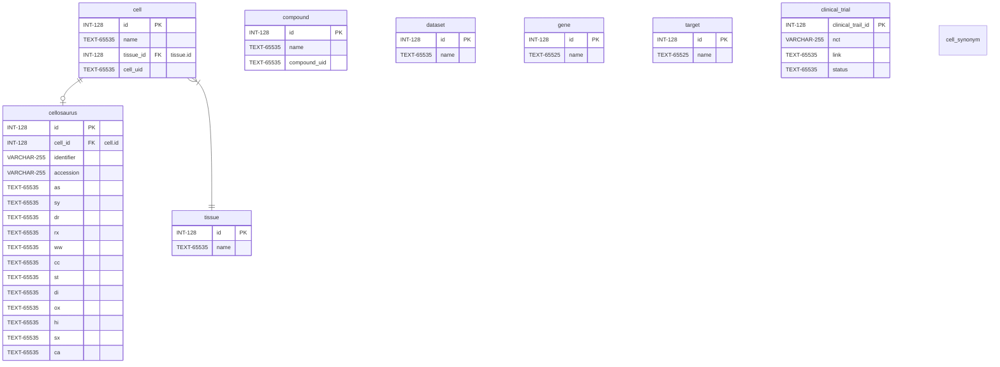

# PharmacoDB-JS Web Application

## Setup Instructions

-   Clone the repo

```bash
git clone https://github.com/bhklab/PharmacoDB-JS.git
cd PharmacoDB-JS
```

-   In the project directory, install all server dependencies `npm i`
-   Create .env using .env.example as a reference to access the database
-   Start the server by running `npm start` or `npm run devstart`(development mode) command
-   Start the client (development mode) by running `npm start`
-   Open [http://localhost:3000](http://localhost:3000) to view it in the browser.

## Dependencies

-   React
-   React-Router
-   Express
-   Knex
-   Body-parser

## Dev Dependenices
1
-   Nodemon
-   Eslint

## Servers

-   Production Server: https://pharmacodb.ca/

## Migrations

-   `knex migrate:make (migration_name)` - To create a new migration file.
-   `knex migrate:latest` - To run the lastest migrations and create corresponding tables.

## Seeds (Seeding Files)

-   Create manually a file (`touch file_name`).
-   Run `knex seed:run` to run the seeding file(s) in order to seed the table(s) in the database.

## Database Schema


